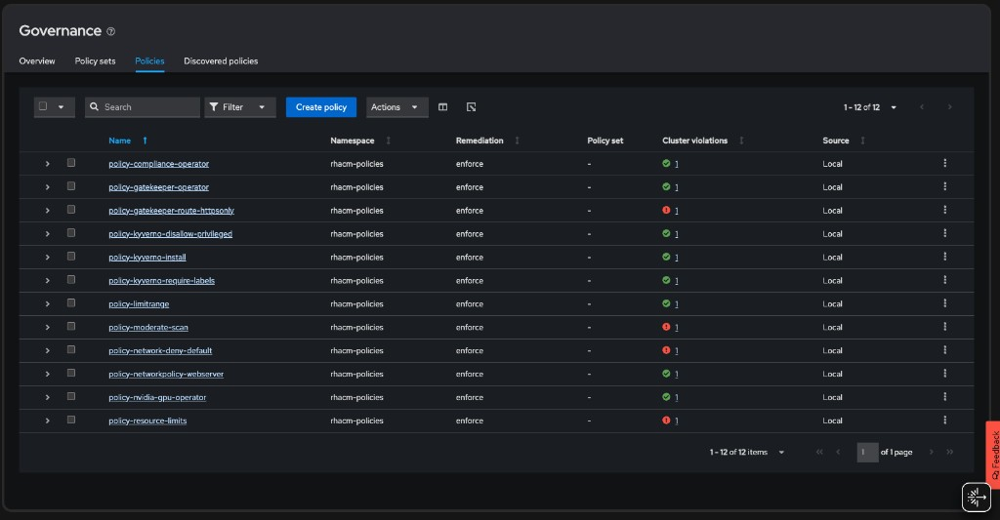

# Exercise 6 - Open Policy Agent Gatekeeper

In this exercise you will go through the Compliance features that come with Open Policy Agent Gatekeeper and the Compliance Operator. You will apply a number of policies to the cluster in order to comply with global security and management standards.

**Context note:** This exercise uses both the hub cluster (`<hub> $`) and `standard-cluster` (`<managed cluster> $`). If you set up named contexts in [Exercise 5](../05.Governance-Risk-Compliance/README.md), switch between them with:

```
$ oc config use-context hub                # for <hub> $ commands
$ oc config use-context standard-cluster   # for <managed cluster> $ commands
```

## Gatekeeper

In this section you create and manage Gatekeeper policies. The policies are based on the REGO policy language.

Apply the next policy to the hub cluster. The policy installs the Gatekeeper operator on the managed cluster.
Note: This policy is applicable for clusters with environment=dev label.


NOTE: The `rhacm-policies` namespace may already exist from Module 01 or 05. The command below is idempotent.

```
<hub> $ oc create namespace rhacm-policies --dry-run=client -o yaml | oc apply -f -
<hub> $ cat > policy-gatekeeper-operator.yaml << EOF
---
apiVersion: policy.open-cluster-management.io/v1
kind: Policy
metadata:
  name: policy-gatekeeper-operator
  namespace: rhacm-policies
  annotations:
    policy.open-cluster-management.io/standards: NIST SP 800-53
    policy.open-cluster-management.io/categories: CM Configuration Management
    policy.open-cluster-management.io/controls: CM-2 Baseline Configuration
spec:
  remediationAction: enforce
  disabled: false
  policy-templates:
  - objectDefinition:
      apiVersion: policy.open-cluster-management.io/v1
      kind: ConfigurationPolicy
      metadata:
        name: gatekeeper-operator-product-sub
      spec:
        remediationAction: enforce
        severity: high
        object-templates:
          - complianceType: musthave
            objectDefinition:
              apiVersion: operators.coreos.com/v1alpha1
              kind: Subscription
              metadata:
                name: gatekeeper-operator-product
                namespace: openshift-operators
              spec:
                channel: stable
                installPlanApproval: Automatic
                name: gatekeeper-operator-product
                source: redhat-operators
                sourceNamespace: openshift-marketplace
  - objectDefinition:
      apiVersion: policy.open-cluster-management.io/v1
      kind: ConfigurationPolicy
      metadata:
        name: gatekeeper
      spec:
        remediationAction: enforce
        severity: high
        object-templates:
          - complianceType: musthave
            objectDefinition:
              apiVersion: operator.gatekeeper.sh/v1alpha1
              kind: Gatekeeper
              metadata:
                name: gatekeeper
              spec:
                audit:
                  logLevel: INFO
                  replicas: 1
                validatingWebhook: Enabled
                mutatingWebhook: Disabled
                webhook:
                  emitAdmissionEvents: Enabled
                  logLevel: INFO
                  replicas: 2
---
apiVersion: policy.open-cluster-management.io/v1
kind: PlacementBinding
metadata:
  name: binding-policy-gatekeeper-operator
  namespace: rhacm-policies
placementRef:
  name: placement-policy-gatekeeper-operator
  kind: Placement
  apiGroup: cluster.open-cluster-management.io
subjects:
- name: policy-gatekeeper-operator
  kind: Policy
  apiGroup: policy.open-cluster-management.io
---
apiVersion: cluster.open-cluster-management.io/v1beta1
kind: Placement
metadata:
  name: placement-policy-gatekeeper-operator
  namespace: rhacm-policies
spec:
  predicates:
    - requiredClusterSelector:
        labelSelector:
          matchExpressions:
            - key: environment
              operator: In
              values:
                - dev
EOF

<hub> $ oc apply -f policy-gatekeeper-operator.yaml
```

### Policy #1 - Disallow unencrypted routes

Apply the next policy to the hub cluster in order to deny the creation of http (not encrypted traffic) routes on the managed clusters -

```
<hub> $ cat > policy-gatekeeper-httpsonly.yaml << EOF
---
apiVersion: policy.open-cluster-management.io/v1
kind: Policy
metadata:
  name: policy-gatekeeper-route-httpsonly
  namespace: rhacm-policies
  annotations:
    policy.open-cluster-management.io/standards: NIST SP 800-53
    policy.open-cluster-management.io/categories: CM Configuration Management
    policy.open-cluster-management.io/controls: CM-2 Baseline Configuration
spec:
  remediationAction: enforce
  disabled: false
  policy-templates:
    - objectDefinition:
        apiVersion: policy.open-cluster-management.io/v1
        kind: ConfigurationPolicy
        metadata:
          name: policy-gatekeeper-route-httpsonly
        spec:
          remediationAction: enforce
          severity: low
          object-templates:
            - complianceType: musthave
              objectDefinition:
                apiVersion: templates.gatekeeper.sh/v1beta1
                kind: ConstraintTemplate
                metadata:
                  name: k8shttpsonly
                  annotations:
                    description: Requires Route resources to be HTTPS only.
                spec:
                  crd:
                    spec:
                      names:
                        kind: K8sHttpsOnly
                  targets:
                    - target: admission.k8s.gatekeeper.sh
                      rego: |
                        package k8shttpsonly
                        violation[{"msg": msg}] {
                          input.review.object.kind == "Route"
                          re_match("^(route.openshift.io)/", input.review.object.apiVersion)
                          route := input.review.object
                          not https_complete(route)
                          msg := sprintf("Route should be https. tls configuration is required for %v", [route.metadata.name])
                        }
                        https_complete(route) = true {
                          route.spec["tls"]
                          count(route.spec.tls) > 0
                        }
            - complianceType: musthave
              objectDefinition:
                apiVersion: constraints.gatekeeper.sh/v1beta1
                kind: K8sHttpsOnly
                metadata:
                  name: route-https-only
                spec:
                  match:
                    kinds:
                      - apiGroups: ["route.openshift.io"]
                        kinds: ["Route"]
    - objectDefinition:
        apiVersion: policy.open-cluster-management.io/v1
        kind: ConfigurationPolicy
        metadata:
          name: policy-gatekeeper-audit-httpsonly
        spec:
          remediationAction: inform # will be overridden by remediationAction in parent policy
          severity: low
          object-templates:
            - complianceType: musthave
              objectDefinition:
                apiVersion: constraints.gatekeeper.sh/v1beta1
                kind: K8sHttpsOnly
                metadata:
                  name: route-https-only
                status:
                  totalViolations: 0
    - objectDefinition:
        apiVersion: policy.open-cluster-management.io/v1
        kind: ConfigurationPolicy
        metadata:
          name: policy-gatekeeper-admission-httpsonly
        spec:
          remediationAction: inform # will be overridden by remediationAction in parent policy
          severity: low
          object-templates:
            - complianceType: mustnothave
              objectDefinition:
                apiVersion: v1
                kind: Event
                metadata:
                  namespace: openshift-gatekeeper-system # set it to the actual namespace where gatekeeper is running if different
                  annotations:
                    constraint_action: deny
                    constraint_kind: K8sHttpsOnly
                    constraint_name: route-https-only
                    event_type: violation
---
apiVersion: policy.open-cluster-management.io/v1
kind: PlacementBinding
metadata:
  name: binding-policy-gatekeeper-route-httpsonly
  namespace: rhacm-policies
placementRef:
  name: placement-policy-gatekeeper-route-httpsonly
  kind: Placement
  apiGroup: cluster.open-cluster-management.io
subjects:
  - name: policy-gatekeeper-route-httpsonly
    kind: Policy
    apiGroup: policy.open-cluster-management.io
---
apiVersion: cluster.open-cluster-management.io/v1beta1
kind: Placement
metadata:
  name: placement-policy-gatekeeper-route-httpsonly
  namespace: rhacm-policies
spec:
  predicates:
    - requiredClusterSelector:
        labelSelector:
          matchExpressions:
            - key: environment
              operator: In
              values:
                - dev
EOF

<hub> $ oc apply -f policy-gatekeeper-httpsonly.yaml
```

Wait until both policies are in a compliant state before you move forward with the exercise.

Login to the managed cluster and try creating a web server using the next commands -

```
<managed cluster> $ oc create namespace httpd-test

<managed cluster> $ oc create deployment httpd --image=registry.access.redhat.com/ubi9/httpd-24:latest -n httpd-test
<managed cluster> $ oc expose deployment httpd --port=8080 -n httpd-test
```

Try exposing the web server using an unsecure route

```
<managed cluster> $ oc expose svc/httpd -n httpd-test
```

Try exposing the web server using a secure route

```
<managed cluster> $ oc create route edge --service=httpd -n httpd-test
```

### Policy #2 - Namespace Management

In this section you will create a Gatekeeper based policy. The policy will disallow namespaces with the `state: dangerous` label. If a namespace has this label, its creation will be disallowed. Make sure to create a message that indicates the error.

An example of a disallowed namespace:

```
{
  "apiVersion": "v1",
  "kind": "Namespace",
  "metadata": {
    "labels": {
      "state": "dangerous"
    },
    "name": "michael"
  }
}
```

You make use the presentation and the previously created policies as a reference for this policy. Use the [rego playground](https://play.openpolicyagent.org/) to check the validity of your rego policy.

Check the validity of your policy by creating a violating namespace. The creation of the namespace should be disallowed -

```
<managed cluster> $ cat > gatekeeper-disallowed-namespace.yaml << EOF
apiVersion: v1
kind: Namespace
metadata:
  labels:
    state: dangerous
  name: michael
EOF

<managed cluster> $ oc apply -f gatekeeper-disallowed-namespace.yaml
```

## Kyverno

In this section you will deploy and manage [Kyverno](https://kyverno.io/) policies. Unlike Gatekeeper which uses the Rego policy language, Kyverno policies are written in standard Kubernetes YAML — making them easier to author and review without learning a new language.

### Install Kyverno and Deploy Policies

The Kyverno community operator available via OLM may not install reliably. An automated script is provided that installs Kyverno via Helm, applies all ACM policies, and validates everything with tests.

**Prerequisites:** `oc`, `helm`, and a kubeconfig for the managed cluster.

If `helm` is not already installed, install it:

```
<hub> $ curl -fsSL https://raw.githubusercontent.com/helm/helm/main/scripts/get-helm-3 | bash
<hub> $ helm version
```

Export the managed-cluster kubeconfig so the script can reach standard-cluster:

```
<hub> $ oc config view --minify --flatten --context=standard-cluster > /tmp/standard-cluster-kubeconfig
```

Run the script from the hub:

```
<hub> $ export MANAGED_KUBECONFIG=/tmp/standard-cluster-kubeconfig
<hub> $ bash 06.Advanced-Policy-Management/demo-kyverno/install-kyverno.sh
```

The script performs the following steps:

1. Installs Kyverno via Helm on the managed cluster
2. Applies `policy-kyverno-install.yaml` on the hub (registers the ACM install policy in the Governance dashboard)
3. Cleans up stale OLM resources on the managed cluster
4. Applies the shared Placement and both enforcement policies (`policy-kyverno-require-labels.yaml`, `policy-kyverno-disallow-privileged.yaml`)
5. Waits for all three policies to become Compliant
6. Runs four validation tests:
   - Pod without `app.kubernetes.io/name` label — expect **DENIED**
   - Pod with the required label — expect **ALLOWED**
   - Pod with `privileged: true` — expect **DENIED**
   - Pod without privileged flag — expect **ALLOWED**

Expected output at the end:

```
==========================================
  Kyverno Module 06 Results
==========================================
  Passed: 4
  Failed: 0
==========================================
```

Verify Kyverno is running on the managed cluster:

```
<managed cluster> $ oc get pods -n kyverno
NAME                                             READY   STATUS    RESTARTS   AGE
kyverno-admission-controller-...                  1/1     Running   0          2m
kyverno-background-controller-...                 1/1     Running   0          2m
kyverno-cleanup-controller-...                    1/1     Running   0          2m
kyverno-reports-controller-...                    1/1     Running   0          2m
```

<details>
<summary>Manual steps (for reference)</summary>

#### Install Kyverno via ACM Policy

Apply the install policy to the hub cluster. The policy creates the Kyverno namespace, OperatorGroup, and Subscription on managed clusters with `environment=dev`:

```
<hub> $ oc apply -f 06.Advanced-Policy-Management/demo-kyverno/policy-kyverno-install.yaml
```

> **Note:** The community operator install via OLM may fail. If Kyverno pods do not appear after a few minutes, use the Helm-based script above instead.

#### Policy #1 - Require Labels on Pods

This Kyverno policy requires all Pods to carry the `app.kubernetes.io/name` label. Notice how the policy is pure YAML — no Rego required:

```
<hub> $ oc apply -f 06.Advanced-Policy-Management/demo-kyverno/policy-kyverno-require-labels.yaml
```

Wait until the policy is compliant, then test on the managed cluster:

```
<managed cluster> $ oc create namespace kyverno-test

# This should be DENIED — no required label
<managed cluster> $ oc run nginx --image=registry.access.redhat.com/ubi9/nginx-124:latest -n kyverno-test

# This should SUCCEED — has the required label
<managed cluster> $ oc run nginx --image=registry.access.redhat.com/ubi9/nginx-124:latest -n kyverno-test \
    --labels="app.kubernetes.io/name=nginx"
```

#### Policy #2 - Disallow Privileged Containers

This policy blocks any Pod that sets `privileged: true` in its security context:

```
<hub> $ oc apply -f 06.Advanced-Policy-Management/demo-kyverno/policy-kyverno-disallow-privileged.yaml
```

Test on the managed cluster:

```
# This should be DENIED — privileged container
<managed cluster> $ cat << EOF | oc apply -n kyverno-test -f -
apiVersion: v1
kind: Pod
metadata:
  name: privileged-pod
  labels:
    app.kubernetes.io/name: test
spec:
  containers:
  - name: nginx
    image: registry.access.redhat.com/ubi9/nginx-124:latest
    securityContext:
      privileged: true
EOF

# This should SUCCEED — no privileged flag
<managed cluster> $ cat << EOF | oc apply -n kyverno-test -f -
apiVersion: v1
kind: Pod
metadata:
  name: safe-pod
  labels:
    app.kubernetes.io/name: test
spec:
  containers:
  - name: nginx
    image: registry.access.redhat.com/ubi9/nginx-124:latest
EOF
```

Clean up the test namespace:

```
<managed cluster> $ oc delete namespace kyverno-test
```

</details>

### Kyverno vs Gatekeeper — Key Differences

| Feature | Gatekeeper (OPA) | Kyverno |
|---|---|---|
| Policy language | Rego | Kubernetes YAML |
| Learning curve | Steeper (new language) | Lower (familiar YAML) |
| Mutation support | Via `assign`/`modify` | Native `mutate` rules |
| Generation | Not supported | Can generate resources (ConfigMaps, NetworkPolicies) |
| Image verification | Via external data | Built-in `verifyImages` rules |
| OpenShift integration | Red Hat supported operator | Community operator |

Both engines integrate with ACM through `ConfigurationPolicy` wrapping their respective CRDs. Choose based on your team's preferences and requirements.

## Compliance Operator Integration

In this section you will perform an integration between Red Hat Advanced Cluster Management and the OpenSCAP Compliance Operator. You will create an RHACM policy that deploys the Compliance Operator. Afterwards, you will create an RHACM policy that initiates a compliance scan and monitors the results.

Run the next command to deploy the Compliance Operator using an RHACM policy -

```
<hub> $ cd /home/vpcuser/rhacm-workshop
<hub> $ oc apply -f 06.Advanced-Policy-Management/exercise-compliance-operator/policy-compliance-operator.yaml
```

Make sure that the policy has been deployed successfully in RHACM's Governance dashboard - The policy status needs to be **compliant**. The Compliance Operator is deployed in the `openshift-compliance` namespace on the managed cluster.

```
<managed cluster> $ oc get pods -n openshift-compliance
NAME                                                    READY   STATUS      RESTARTS   AGE
compliance-operator-8c9bc7466-8h4js                     1/1     Running     1          7m27s
ocp4-openshift-compliance-pp-6d7c7db4bd-wb5vf           1/1     Running     0          4m51s
rhcos4-openshift-compliance-pp-c7b548bd-8pbhq           1/1     Running     0          4m51s
```

Now that the Compliance Operator is deployed, initiate a compliance scan using an RHACM policy. To initiate a compliance scan, run the next command -

```
<hub> $ oc apply -f 06.Advanced-Policy-Management/exercise-compliance-operator/policy-moderate-scan.yaml
```

After running the command, a compliance scan is initiated. The scan will take about 5 minutes to complete. Run the next command on the managed cluster to check the status of the scan -

```
<managed cluster> $ oc get compliancescan -n openshift-compliance
NAME                     PHASE     RESULT
ocp4-moderate            RUNNING   NOT-AVAILABLE
rhcos4-moderate-master   RUNNING   NOT-AVAILABLE
rhcos4-moderate-worker   RUNNING   NOT-AVAILABLE
```

When the scan completes, the `PHASE` field will change to `DONE`.

After the scan completes, navigate to the RHACM governance dashboard. Note that the newly created policy is in a non-compliant state. Click on the policy name and navigate to **Status**. The `compliance-suite-moderate-results` ConfigurationPolicy is non-compliant because multiple ComplianceCheckResult objects indicate a `FAIL` check-status. To investigate the failing rules, press on _View details_ next to the `compliance-suite-moderate-results` ConfigurationPolicy.

Scroll down, you will notice all failing compliance check results. To understand why these rules failed the scan press on `View yaml` next to the failing rule name.

- Investigate the `ocp4-moderate-banner-or-login-template-set` ComplianceCheckResult. See what you can do to remediate the issue.
- Investigate the `ocp4-moderate-configure-network-policies-namespaces` ComplianceCheckResult. See what you can do to remediate the issue.
- Investigate the `rhcos4-moderate-master-no-empty-passwords` ComplianceCheckResult. See what you can do to remediate the issue.

## Policy Generator with Kustomize

The **Policy Generator** is the modern, recommended approach to managing RHACM policies as code. Instead of hand-crafting large policy YAML documents, you define lightweight policy definitions in a `PolicyGenerator` manifest and use Kustomize to generate the full policy resources. This aligns with GitOps workflows and scales better for large policy sets.

For full documentation, see [Migrate to RHACM Policy Generator](https://developers.redhat.com/articles/2025/02/07/migrate-rhacm-policy-generator-openshift-416).

### Install Kustomize and the Policy Generator Plugin

If `kustomize` is not already installed, install the standalone binary:

```
<hub> $ curl -s "https://raw.githubusercontent.com/kubernetes-sigs/kustomize/master/hack/install_kustomize.sh" | bash -s -- ${HOME}/.local/bin
<hub> $ kustomize version
```

The Policy Generator is a Kustomize plugin. Install it on your workstation:

```
<hub> $ mkdir -p ${HOME}/.config/kustomize/plugin/policy.open-cluster-management.io/v1/policygenerator

<hub> $ curl -L https://github.com/open-cluster-management-io/policy-generator-plugin/releases/latest/download/linux-amd64-PolicyGenerator -o ${HOME}/.config/kustomize/plugin/policy.open-cluster-management.io/v1/policygenerator/PolicyGenerator

<hub> $ chmod +x ${HOME}/.config/kustomize/plugin/policy.open-cluster-management.io/v1/policygenerator/PolicyGenerator
```

### Create a Policy Generator Manifest

Create a directory for your policy generator configuration:

```
<hub> $ mkdir -p policy-generator-exercise && cd policy-generator-exercise
```

Create a `policy-generator.yaml` file:

```
<hub> $ cat > policy-generator.yaml << EOF
apiVersion: policy.open-cluster-management.io/v1
kind: PolicyGenerator
metadata:
  name: policy-generator-exercise
placementBindingDefaults:
  name: binding-policy-generator
policyDefaults:
  namespace: rhacm-policies
  placement:
    name: placement-dev-clusters
    labelSelector:
      environment: dev
  remediationAction: enforce
  severity: medium
policies:
  - name: policy-network-deny-default
    manifests:
      - path: manifests/deny-all-networkpolicy.yaml
  - name: policy-resource-limits
    manifests:
      - path: manifests/limitrange.yaml
EOF
```

Create the source manifests:

```
<hub> $ mkdir manifests

<hub> $ cat > manifests/deny-all-networkpolicy.yaml << EOF
kind: NetworkPolicy
apiVersion: networking.k8s.io/v1
metadata:
  name: deny-by-default
spec:
  podSelector: {}
  ingress: []
EOF

<hub> $ cat > manifests/limitrange.yaml << EOF
apiVersion: v1
kind: LimitRange
metadata:
  name: workshop-limit-range
spec:
  limits:
  - default:
      memory: 512Mi
    defaultRequest:
      memory: 256Mi
    type: Container
EOF
```

Create a `kustomization.yaml`:

```
<hub> $ cat > kustomization.yaml << EOF
generators:
  - policy-generator.yaml
EOF
```

### Generate and Apply the Policies

Generate the policies to see what will be created:

```
<hub> $ kustomize build --enable-alpha-plugins .
```

Review the output — you should see two `Policy` resources, a `Placement`, and a `PlacementBinding`, all generated from the lightweight definitions above.

Apply the generated policies:

```
<hub> $ kustomize build --enable-alpha-plugins . | oc apply -f -
```

Verify in the RHACM Governance dashboard that the generated policies appear and are compliant.

After completing all sections of this module, the RHACM Governance dashboard should show all 13 policies:



### Advantages of Policy Generator

- **Less YAML**: Source manifests are plain Kubernetes resources; the generator wraps them in ACM policy structures
- **GitOps-friendly**: Store policy definitions in Git and use CI/CD to generate and apply
- **Consistent**: Default settings (namespace, placement, remediation) are defined once
- **Scalable**: Easily manage hundreds of policies across a fleet