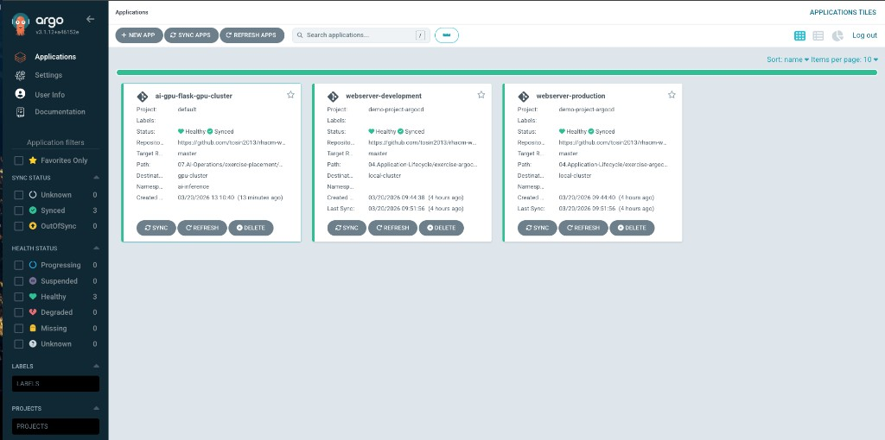
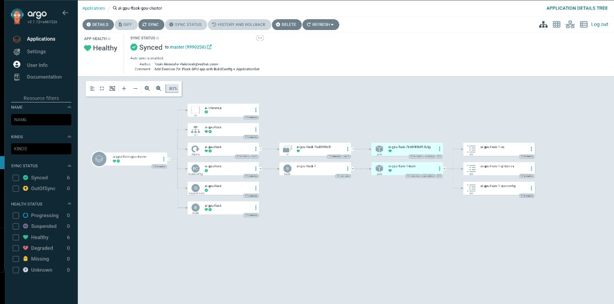
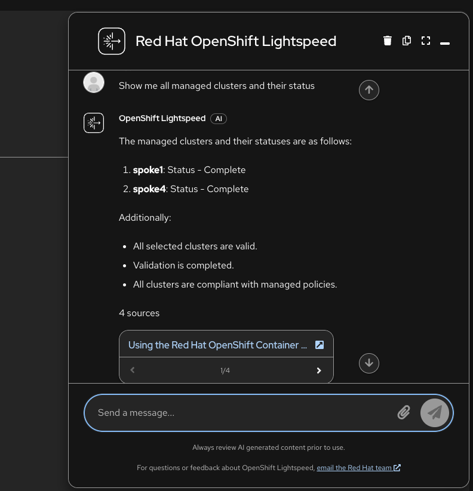
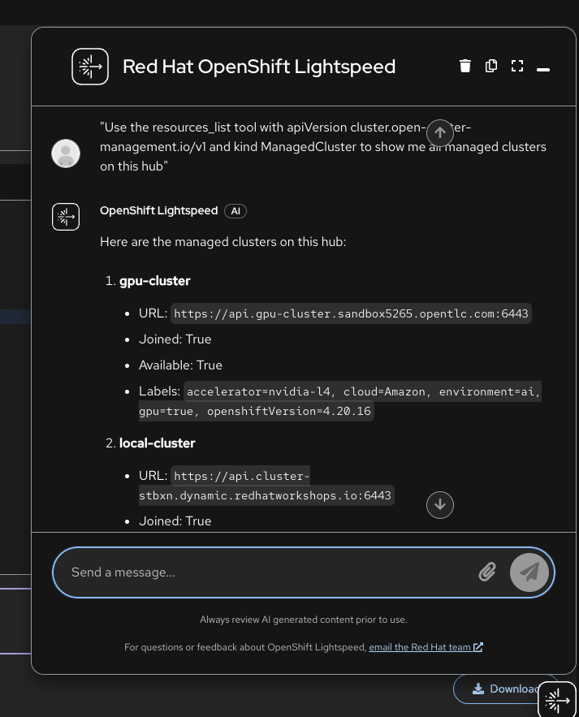

# Exercise 7 - AI-Powered Operations

This module introduces AI-powered multicluster operations with Red Hat Advanced Cluster Management. You will:

- Deploy an AI inference workload to GPU-capable clusters using ArgoCD ApplicationSets and the Placement API
- Wire the OpenShift Lightspeed MCP Server into the OLS pipeline so the Lightspeed console returns live cluster data instead of hallucinated answers

**Prerequisites:**
- Completed Module 01 (clusters provisioned and GPU Operator installed on gpu-cluster)
- The gpu-cluster has the label `gpu=true` and the NVIDIA GPU Operator installed
- OpenShift GitOps (ArgoCD) is installed on the hub cluster
- OpenShift Lightspeed is installed on the hub cluster

**Context note:** Most commands run on the **hub cluster** (`<hub> $`). Some verification steps in section 7A benefit from direct access to **gpu-cluster**. If you set up named contexts in [Exercise 5](../05.Governance-Risk-Compliance/README.md), you already have `hub` and `standard-cluster`. Add `gpu-cluster` the same way:

```
# Retrieve the gpu-cluster credentials and API URL:
<hub> $ SECRET_NAME=$(oc get clusterdeployment gpu-cluster -n gpu-cluster \
         -o jsonpath='{.spec.clusterMetadata.adminPasswordSecretRef.name}')
<hub> $ GPU_PWD=$(oc get secret $SECRET_NAME -n gpu-cluster -o jsonpath='{.data.password}' | base64 -d)
<hub> $ GPU_URL=$(oc get managedcluster gpu-cluster -o jsonpath='{.spec.managedClusterClientConfigs[0].url}')

# Log into gpu-cluster and name its context:
<hub> $ oc login -u kubeadmin -p $GPU_PWD $GPU_URL --insecure-skip-tls-verify=true
       $ oc config rename-context $(oc config current-context) gpu-cluster

# Switch back to the hub:
       $ oc config use-context hub
```

From now on, switch contexts with:
```
$ oc config use-context hub           # for <hub> $ commands
$ oc config use-context gpu-cluster   # for <gpu-cluster> $ commands
```

---

## 7A - AI Workload Placement via ApplicationSet

In this exercise, you will build a Flask-based GPU inference app from source on the target cluster using an OpenShift BuildConfig, and deploy it via an ArgoCD ApplicationSet that uses ACM's Placement API to route workloads to GPU-enabled clusters.

### Step 1 - Apply the GPU Operator Policy

If not already applied during Module 01, install the NVIDIA GPU Operator on all `gpu=true` clusters:

```
<hub> $ oc apply -f 01.RHACM-Installation/cluster-provisioning/gpu-operator-policy.yaml
```

Verify it becomes Compliant:

```
<hub> $ oc get policy policy-nvidia-gpu-operator -n rhacm-policies
NAME                         REMEDIATION ACTION   COMPLIANCE STATE   AGE
policy-nvidia-gpu-operator   enforce              Compliant          ...
```

### Step 2 - Verify GPU Cluster Readiness

Confirm the gpu-cluster is available:

```
<hub> $ oc get managedcluster gpu-cluster
NAME          HUB ACCEPTED   MANAGED CLUSTER URLS   JOINED   AVAILABLE   AGE
gpu-cluster   true           https://...            True     True        ...
```

### Step 3 - Register gpu-cluster in ArgoCD

The gpu-cluster lives in the `default` ManagedClusterSet but is not registered in ArgoCD by default. Apply the hub resources to register it:

```
<hub> $ oc apply -f 07.AI-Operations/exercise-placement/hub/managedclustersetbinding.yaml
<hub> $ oc apply -f 07.AI-Operations/exercise-placement/hub/placement.yaml
<hub> $ oc apply -f 07.AI-Operations/exercise-placement/hub/gitopscluster.yaml
```

This creates:
- A **ManagedClusterSetBinding** that makes the `default` ClusterSet available in the `openshift-gitops` namespace
- A **Placement** (`gpu-clusters`) that selects clusters with `gpu=true` and scores them by CPU and memory
- A **GitOpsCluster** that registers matched clusters in ArgoCD

Verify gpu-cluster appears as an ArgoCD cluster:

```
<hub> $ oc get secret -n openshift-gitops -l apps.open-cluster-management.io/acm-cluster
NAME                                               TYPE     DATA   AGE
gpu-cluster-application-manager-cluster-secret     Opaque   3      ...
local-cluster-application-manager-cluster-secret   Opaque   3      ...
```

Check the PlacementDecision selected gpu-cluster:

```
<hub> $ oc get placementdecision -n openshift-gitops -l cluster.open-cluster-management.io/placement=gpu-clusters \
    -o jsonpath='{.items[0].status.decisions[*].clusterName}'
gpu-cluster
```

### Step 4 - Review the AI Inference App

The app source code lives in `07.AI-Operations/exercise-placement/app/`:

| File | Purpose |
|------|---------|
| `app.py` | Flask app with `/health`, `/gpu` (runs nvidia-smi), `/predict` (matrix multiply), `/info` |
| `requirements.txt` | flask, numpy, gunicorn |
| `Dockerfile` | Based on UBI9 Python 3.11 |

The Kubernetes manifests in `07.AI-Operations/exercise-placement/manifests/` include:
- **BuildConfig**: Builds the image from the git repo directly on the target cluster
- **ImageStream**: Stores the built image
- **Deployment**: Runs the app requesting `nvidia.com/gpu: "1"`
- **Service** and **Route**: Expose the app externally

### Step 5 - Deploy via ApplicationSet

Apply the ApplicationSet that uses the `clusterDecisionResource` generator to read from the gpu-clusters PlacementDecision:

```
<hub> $ oc apply -f 07.AI-Operations/exercise-placement/hub/applicationset.yaml
```

Verify the Application was created and is syncing:

```
<hub> $ oc get application.argoproj.io -n openshift-gitops
NAME                       SYNC STATUS   HEALTH STATUS
ai-gpu-flask-gpu-cluster   Synced        Healthy
```

The ApplicationSet automatically:
1. Reads the PlacementDecision to find gpu-cluster
2. Creates an ArgoCD Application targeting gpu-cluster
3. Deploys all manifests (namespace, buildconfig, deployment, service, route)
4. The BuildConfig triggers a build on gpu-cluster from the git source

In the ArgoCD console, you should see the `ai-gpu-flask-gpu-cluster` application alongside any existing applications:



Drilling into the application shows the full resource tree -- namespace, deployment, build, service, and route all healthy:



### Step 6 - Test Placement Behavior

Patch the Placement to require `gpu-count >= 2`:

```
<hub> $ oc patch placement gpu-clusters -n openshift-gitops --type=merge -p '
spec:
  predicates:
    - requiredClusterSelector:
        labelSelector:
          matchLabels:
            gpu: "true"
        claimSelector:
          matchExpressions:
            - key: gpu-count
              operator: Gt
              values:
                - "1"
'
```

Check the PlacementDecision:

```
<hub> $ oc get placementdecision -n openshift-gitops -l cluster.open-cluster-management.io/placement=gpu-clusters \
    -o jsonpath='{.items[0].status.decisions}'
[]
```

No cluster matches because no cluster has `gpu-count >= 2`. The ApplicationSet controller will remove the Application on its next reconcile cycle. This demonstrates how ACM prevents workload misplacement.

Revert to the original Placement:

```
<hub> $ oc apply -f 07.AI-Operations/exercise-placement/hub/placement.yaml
```

### Step 7 - Cleanup

```
<hub> $ oc delete -f 07.AI-Operations/exercise-placement/hub/applicationset.yaml
<hub> $ oc delete -f 07.AI-Operations/exercise-placement/hub/gitopscluster.yaml
<hub> $ oc delete -f 07.AI-Operations/exercise-placement/hub/placement.yaml
<hub> $ oc delete -f 07.AI-Operations/exercise-placement/hub/managedclustersetbinding.yaml
```

---

## 7B - Wiring OpenShift Lightspeed to the MCP Server

OpenShift Lightspeed includes a built-in **Kubernetes MCP Server** (`openshift-mcp-server`) that runs as a sidecar container in the `lightspeed-app-server` pod. This server implements the [Model Context Protocol](https://modelcontextprotocol.io/) and provides 14 read-only tools for querying live cluster resources.

Out of the box, the sidecar is **deployed** but **not wired** to the OLS API. The Lightspeed console sends questions to the LLM (GPT-4) which answers from documentation only -- it has no access to real cluster data and will hallucinate cluster names.

In this exercise you will wire the MCP server into the OLS pipeline so the Lightspeed console returns accurate, live data from your RHACM fleet.

### Step 1 - Observe the Problem (Before)

Open the Lightspeed console in the OpenShift web UI and ask:

> **Show me all managed clusters and their status**

Without the MCP server wired in, the LLM pulls from Red Hat documentation examples and returns fabricated cluster names like "spoke1" and "spoke4":



This happens because:
- The `openshift-mcp-server` sidecar is running on port 8080
- But the OLS API (port 8443) is not configured to connect to it
- The LLM answers from documentation RAG context only

### Architecture

```
┌──────────────────────────────────────────────────────────────┐
│  lightspeed-app-server Pod                                   │
│                                                              │
│  ┌─────────────────────┐      ┌──────────────────────────┐   │
│  │ lightspeed-service-  │      │ openshift-mcp-server     │   │
│  │ api         :8443    │─────▶│                  :8080    │   │
│  │                      │ SSE  │  /sse  /mcp  /healthz    │   │
│  └──────────┬──────────┘      └─────────────┬────────────┘   │
│             │                                │               │
└─────────────┼────────────────────────────────┼───────────────┘
              │                                │ uses SA token
              ▼                                ▼
         GPT-4 (Azure)                  Kubernetes API
              │                                │
              │  tool_calls ──────────▶ ManagedClusters
              │  tool_results ◀─────── Policies, Pods,
              │                        PlacementDecisions...
              ▼
     Response with real data
```

Three `OLSConfig` settings connect these components:

| Setting | Purpose |
|---------|---------|
| `spec.featureGates: ["MCPServer"]` | Enables the MCP feature (disabled by default) |
| `spec.mcpServers[].url` | Tells the OLS API where the MCP server lives |
| `spec.ols.toolsApprovalConfig` | Lets the LLM invoke MCP tools automatically |

### Step 2 - Grant RBAC for RHACM Resource Access

The MCP server sidecar uses the `lightspeed-app-server` ServiceAccount, which by default only has permissions for token reviews. It needs `cluster-reader` to query RHACM resources:

```
<hub> $ oc apply -f 07.AI-Operations/exercise-lightspeed/lightspeed-mcp-rbac.yaml
```

This creates a ClusterRoleBinding granting `cluster-reader` to the `lightspeed-app-server` SA in the `openshift-lightspeed` namespace.

### Step 3 - Wire the MCP Server to OLS

This is the key step. Patch the `OLSConfig` to enable the feature gate, register the MCP server URL, and allow automatic tool execution:

```
<hub> $ oc patch olsconfig cluster --type=merge -p '{
  "spec": {
    "featureGates": ["MCPServer"],
    "mcpServers": [
      {
        "name": "openshift-mcp-server",
        "url": "http://localhost:8080/sse",
        "timeout": 30
      }
    ],
    "ols": {
      "toolsApprovalConfig": {
        "approvalType": "never"
      }
    }
  }
}'
```

What each field does:

- **`featureGates: ["MCPServer"]`** -- Enables the MCP feature in the OLS backend. Without this, the LLM never receives the MCP tools.
- **`mcpServers[0].url: "http://localhost:8080/sse"`** -- Points the OLS API to the MCP sidecar. Since both containers share the same pod, `localhost:8080` works. The `/sse` endpoint provides Server-Sent Events transport.
- **`toolsApprovalConfig.approvalType: "never"`** -- Lets the LLM call MCP tools (like `resources_list`, `pods_list`) automatically without requiring per-call user approval.

The YAML version of this patch is in `07.AI-Operations/exercise-lightspeed/olsconfig-mcp-patch.yaml`.

Wait for the operator to roll out the new pod:

```
<hub> $ oc rollout status deployment/lightspeed-app-server -n openshift-lightspeed --timeout=120s
<hub> $ oc get olsconfig cluster -o jsonpath='{.status.overallStatus}'
Ready
```

### Step 4 - Verify the Fix (After)

Go back to the Lightspeed console and ask the same question:

> **Use the resources_list tool with apiVersion cluster.open-cluster-management.io/v1 and kind ManagedCluster to show me all managed clusters on this hub**

The response now includes the **real** managed clusters with live data:

- **gpu-cluster** -- Available, labels: `gpu=true`, `accelerator=nvidia-l4`
- **local-cluster** -- Available, labels: `environment=hub`
- **standard-cluster** -- Available, labels: `environment=production`



You can verify the tool was invoked by checking the OLS API logs:

```
<hub> $ oc logs -n openshift-lightspeed -l app.kubernetes.io/component=application-server \
    -c lightspeed-service-api --tail=20 | grep -i "tool"
```

### Step 5 - Expose the MCP Server Externally

The internal wiring is done. To also allow external MCP clients (IDEs, CLI tools) to connect, create a dedicated Service and Route for the MCP endpoint:

```
<hub> $ oc apply -f 07.AI-Operations/exercise-lightspeed/lightspeed-mcp-service.yaml
<hub> $ oc apply -f 07.AI-Operations/exercise-lightspeed/lightspeed-route.yaml
```

Get the external MCP endpoint:

```
<hub> $ export MCP_URL=$(oc get route lightspeed-mcp -n openshift-lightspeed -o jsonpath='{.spec.host}')
<hub> $ echo "MCP endpoint: https://${MCP_URL}"
```

### Step 6 - Verify via MCP Endpoint

Test the health endpoint:

```
<hub> $ curl -sk https://${MCP_URL}/healthz
<hub> $ curl -sk https://${MCP_URL}/stats
```

Test a full MCP session querying managed clusters:

```
<hub> $ SESSION_ID=$(curl -sk -D - -X POST https://${MCP_URL}/mcp \
    -H "Content-Type: application/json" \
    -d '{"jsonrpc":"2.0","id":1,"method":"initialize","params":{"protocolVersion":"2024-11-05","capabilities":{},"clientInfo":{"name":"test","version":"1.0"}}}' \
    | grep -i "mcp-session-id" | tr -d "\r" | awk '{print $2}')

<hub> $ curl -sk -X POST https://${MCP_URL}/mcp \
    -H "Content-Type: application/json" \
    -H "Mcp-Session-Id: $SESSION_ID" \
    -d '{"jsonrpc":"2.0","method":"notifications/initialized"}'

<hub> $ curl -sk -X POST https://${MCP_URL}/mcp \
    -H "Content-Type: application/json" \
    -H "Mcp-Session-Id: $SESSION_ID" \
    -d '{"jsonrpc":"2.0","id":2,"method":"tools/call","params":{"name":"resources_list","arguments":{"apiVersion":"cluster.open-cluster-management.io/v1","kind":"ManagedCluster"}}}'
```

You should see all three managed clusters (gpu-cluster, local-cluster, standard-cluster) returned with their labels and status.

### Step 7 - Connect Your IDE

For **Cursor**, add to `.cursor/mcp.json`:

```json
{
  "mcpServers": {
    "openshift-mcp": {
      "url": "https://<your-lightspeed-mcp-route>/sse"
    }
  }
}
```

For a **local Kubernetes MCP server** (alternative approach using npx), first create a service account and kubeconfig:

```
<hub> $ oc apply -f 07.AI-Operations/exercise-mcp/mcp-serviceaccount.yaml
<hub> $ export MCP_TOKEN=$(oc create token mcp-viewer -n mcp --duration=2h)
<hub> $ export API_SERVER=$(oc whoami --show-server)
<hub> $ export CA_DATA=$(oc get configmap kube-root-ca.crt -n mcp -o jsonpath='{.data.ca\.crt}' | base64 -w0)
<hub> $ cat > /tmp/mcp-kubeconfig.yaml << EOF
apiVersion: v1
kind: Config
clusters:
  - cluster:
      server: ${API_SERVER}
      certificate-authority-data: ${CA_DATA}
    name: hub-cluster
contexts:
  - context:
      cluster: hub-cluster
      user: mcp-viewer
    name: mcp-context
current-context: mcp-context
users:
  - name: mcp-viewer
    user:
      token: ${MCP_TOKEN}
EOF
```

Then add to `.cursor/mcp.json`:

```json
{
  "mcpServers": {
    "kubernetes": {
      "command": "npx",
      "args": ["-y", "kubernetes-mcp-server@latest", "--kubeconfig", "/tmp/mcp-kubeconfig.yaml", "--read-only"]
    }
  }
}
```

### Step 8 - Query Your Fleet

Once connected, you can ask your AI assistant questions about the RHACM fleet. The LLM does not know RHACM API versions by default, so include the `apiVersion` and `kind` in your questions for reliable results.

**RHACM Fleet Management:**

- "Use the resources_list tool with apiVersion cluster.open-cluster-management.io/v1 and kind ManagedCluster to show me all managed clusters on this hub"
- "Use the resources_get tool with apiVersion cluster.open-cluster-management.io/v1, kind ManagedCluster, and name gpu-cluster to show its labels and capacity"
- "Use the resources_list tool with apiVersion policy.open-cluster-management.io/v1 and kind Policy to list all governance policies and their compliance state"
- "Use the resources_list tool with apiVersion cluster.open-cluster-management.io/v1beta1 and kind Placement to show all Placement resources"

**Cluster Operations:**

- "Use the nodes_top tool to show CPU and memory usage for all nodes"
- "Use the pods_top tool to show the top resource-consuming pods across all namespaces"
- "Use the pods_list_in_namespace tool to list all pods in the open-cluster-management namespace"
- "Use the events_list tool to show any recent warning events"

**RHACM API Version Cheat Sheet:**

| Resource | apiVersion | kind |
|----------|-----------|------|
| Managed Clusters | `cluster.open-cluster-management.io/v1` | `ManagedCluster` |
| Policies | `policy.open-cluster-management.io/v1` | `Policy` |
| Placements | `cluster.open-cluster-management.io/v1beta1` | `Placement` |
| PlacementDecisions | `cluster.open-cluster-management.io/v1beta1` | `PlacementDecision` |
| ManagedClusterSets | `cluster.open-cluster-management.io/v1beta2` | `ManagedClusterSet` |

### Cleanup

To revert the OLSConfig patch:

```
<hub> $ oc patch olsconfig cluster --type=json -p '[
  {"op":"remove","path":"/spec/featureGates"},
  {"op":"remove","path":"/spec/mcpServers"},
  {"op":"remove","path":"/spec/ols/toolsApprovalConfig"}
]'
```

To remove the external route, service, and RBAC:

```
<hub> $ oc delete -f 07.AI-Operations/exercise-lightspeed/lightspeed-route.yaml
<hub> $ oc delete -f 07.AI-Operations/exercise-lightspeed/lightspeed-mcp-service.yaml
<hub> $ oc delete -f 07.AI-Operations/exercise-lightspeed/lightspeed-mcp-rbac.yaml
```
